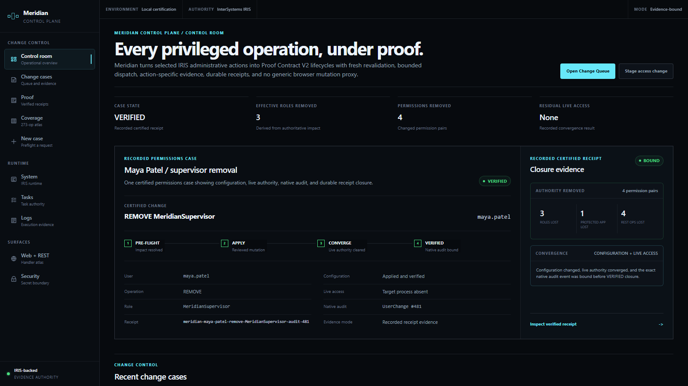
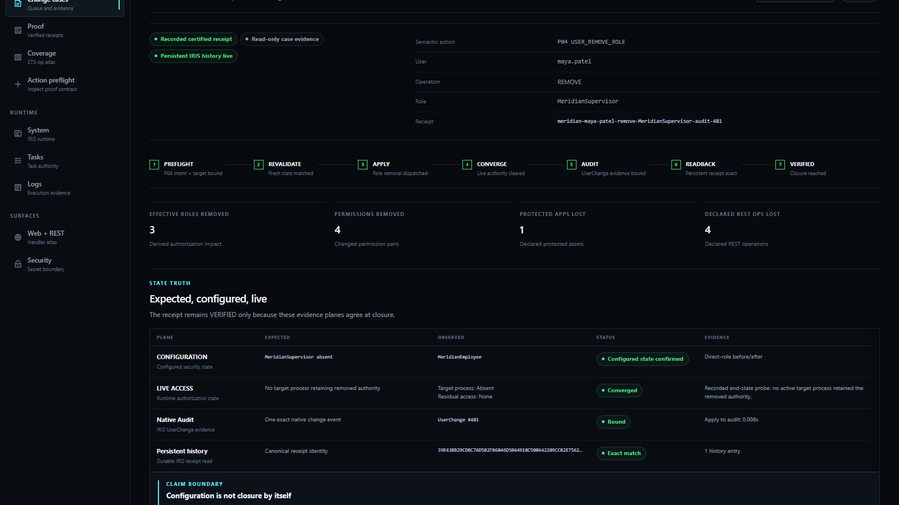
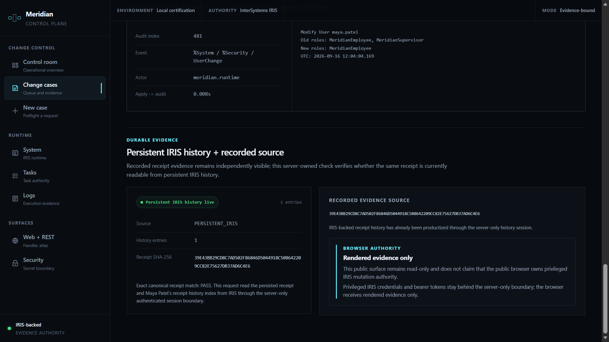
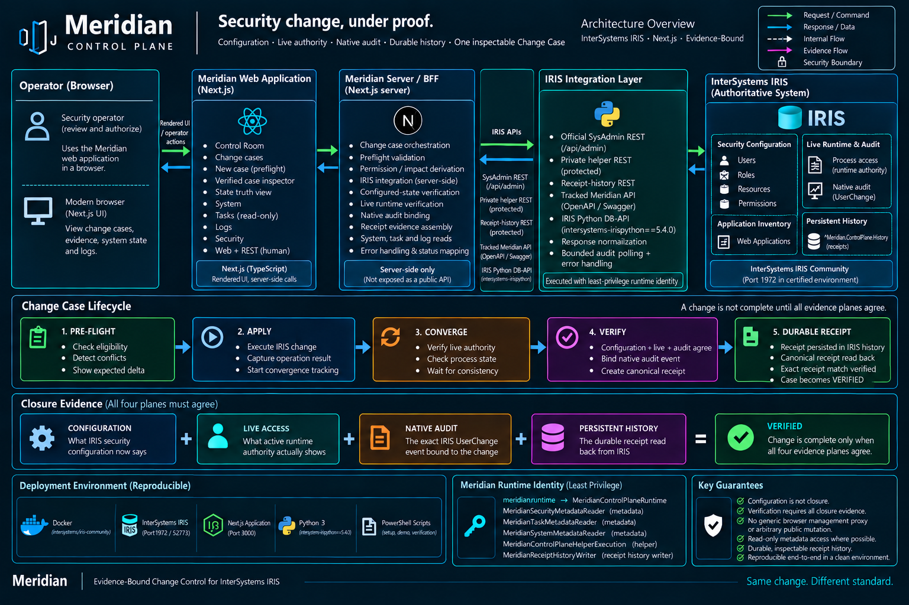
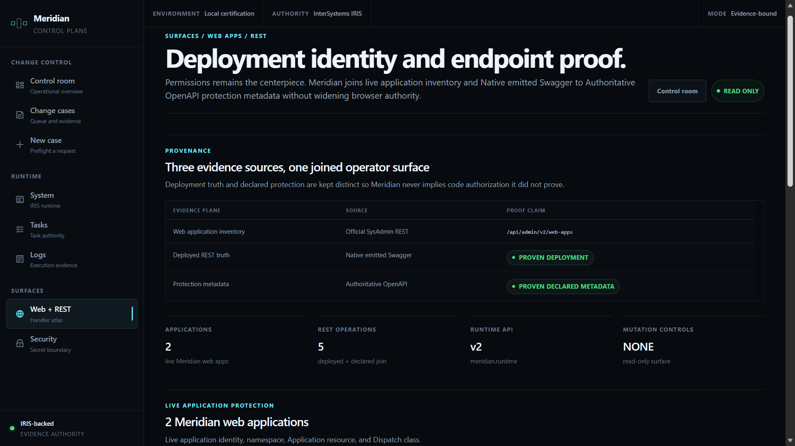

# Meridian

**Security change, under proof.**

Meridian is an evidence-bound control plane for InterSystems IRIS. It treats a security change as complete only when **configured state, live runtime authority, native IRIS audit evidence, and durable receipt history agree**.

> **Configuration is not closure.**

<p align="center">
  
</p>

## Judge fast path

**[Watch the 4:24 product demo](https://youtu.be/AtTjQKhURbg)** · **[See the 30-second thing to notice](#the-30-second-thing-to-notice)** · **[Inspect the Maya centerpiece](#centerpiece--maya-patel-supervisor-removal)** · **[View the architecture](#architecture)** · **[Run Meridian locally](#local-reproduction)** · **[Read the authority model](#authority-boundaries)**

Built for the **InterSystems Programming Contest — Build Your Own Management Portal**.

### The 30-second thing to notice

A successful security write is not the same thing as proven closure.

Meridian keeps four evidence planes separate:

1. **CONFIGURATION** — what IRIS security configuration now says;
2. **LIVE ACCESS** — what active runtime authority actually shows;
3. **NATIVE AUDIT** — the exact IRIS `UserChange` event bound to the change; and
4. **PERSISTENT HISTORY** — the durable receipt read back from IRIS.

The centerpiece case is not marked **VERIFIED** merely because the role change was applied.

It closes only when those evidence planes agree.

> **Configured state is evidence. Live state is evidence. Audit is evidence. Persistence is evidence. Closure requires the chain.**

---

## The problem

Administrative security tools often make one moment visually dominant: **the write succeeded**.

That is useful, but it is not the whole operational question.

For a sensitive authorization change, an operator may also need to know:

- what authority the change is expected to remove;
- what protected applications or REST operations depend on that authority;
- whether the intended configuration was actually applied;
- whether live process authority has converged to the intended state;
- which native audit event proves the change happened;
- whether the evidence can still be read back durably later; and
- which parts of the system were allowed to read or mutate each piece of evidence.

Meridian turns those questions into one explicit **Change Case lifecycle**.

The product does not assume that every IRIS role change produces stale live authority, and it does not claim that IRIS security is broken. Its claim is narrower:

> **A security change should not be called complete until the evidence required by the Change Case is complete.**

---

## Why Meridian is different

Meridian is not a replacement skin for the full IRIS Management Portal.

It is also not a generic dashboard that puts every management operation behind one privileged browser session.

The product is intentionally opinionated around a smaller primitive:

```text
PRE-FLIGHT
    ↓
APPLY
    ↓
CONVERGE
    ↓
VERIFIED
    ↓
DURABLE RECEIPT
```

The important separation is between **intent**, **configuration**, **runtime truth**, and **evidence**.

That creates a different operating model:

- preview impact before mutation;
- revalidate immediately before applying the change;
- keep configured state and live access as separate evidence planes;
- refuse premature verification;
- bind a native IRIS audit event;
- persist a stable receipt identity;
- read that receipt back through a server-only authenticated boundary; and
- keep operational inspection surfaces read-only unless a narrowly scoped action genuinely needs more authority.

---

## Built and verified

Meridian is a working local prototype against a pinned InterSystems IRIS Community runtime, not a static mockup.

The current build includes:

- a **Next.js operator interface** with a control room, Change Queue, verified-case inspector, and five additional management surfaces;
- **official InterSystems SysAdmin REST** integration for supported management data;
- tracked IRIS REST classes for Meridian-specific application, helper, and durable-history boundaries;
- a least-privilege runtime identity: `meridian.runtime`;
- dedicated escalation-only metadata roles instead of one broad browser authority;
- a bounded role-mutation path with preflight and immediate revalidation;
- live authorization convergence evidence;
- exact native `UserChange` audit binding;
- persistent IRIS receipt history;
- a safe, repeatable demo fixture lifecycle;
- a masked runtime-password startup path; and
- automated tests, typechecking, linting, and production build gates.

The normal quality gate is:

```powershell
npm test
npm run typecheck
npm run lint
npm run build
```

The published demo build was also exercised through live browser-route and persistent-history checks before submission packaging.

---

## What Meridian does

For a bounded security role change, Meridian can:

1. identify the target user and direct/effective role state;
2. compute the expected authorization delta;
3. map that delta to declared application and REST impact;
4. present a reviewable preflight before mutation;
5. revalidate the target state immediately before applying;
6. execute the approved role mutation through the IRIS management boundary;
7. verify the resulting configuration;
8. inspect live process authority separately from configuration;
9. wait for the Change Case to converge instead of declaring premature success;
10. bind the exact native IRIS audit event;
11. freeze a stable receipt identity;
12. persist and read back receipt history from IRIS; and
13. expose runtime, task, log, security, web-application, and REST evidence under narrow authority.

---

## Centerpiece — Maya Patel supervisor removal

The certified centerpiece removes `MeridianSupervisor` from `maya.patel`.

```text
REMOVE MeridianSupervisor FROM maya.patel
```

Lifecycle:

```text
PROPOSED
  ↓
PREFLIGHTED
  ↓
REVALIDATED
  ↓
APPLIED
  ↓
CONFIG VERIFIED
  ↓
RUNTIME CHECKED
  ↓
CONVERGED
  ↓
NATIVE AUDIT BOUND
  ↓
VERIFIED
```

At closure, Meridian presents four independent evidence planes:

<p align="center">
  
</p>

### State truth

| Evidence plane | Expected | Observed | Closure state |
| --- | --- | --- | --- |
| **Configuration** | `MeridianSupervisor` absent | `MeridianEmployee` remains | Applied and verified |
| **Live access** | No target process retaining removed authority | Target process absent; residual access none | Converged |
| **Native Audit** | One exact native change event | `UserChange #481` | Bound |
| **Persistent history** | Canonical receipt identity | Matching persisted receipt | Exact match |

The UI states the invariant directly:

> **Configuration is not closure by itself.**

### Permission delta

The recorded permission delta makes removed and retained authority explicit.

**Lost**

- `%Admin_Task : USE`
- `Meridian_Admin : USE`
- `Meridian_Jobs : USE`
- `Meridian_Orders : WRITE`

**Retained**

- `Meridian_Orders : READ`
- `Meridian_Portal : USE`

This matters because a role name is only a shorthand. The operator needs to see the authority consequences that role change actually implies.

### Native audit closure

The certified receipt binds one exact IRIS audit event:

```text
Audit index: 481
Event:       %System / %Security / UserChange
Actor:       meridian.runtime
Old roles:   MeridianEmployee, MeridianSupervisor
New roles:   MeridianEmployee
Apply→audit: 0.008s
```

The dashboard is therefore not asking the operator to trust its own success message. It shows the native evidence used to close the audit side of the receipt.

### Durable receipt history

The same receipt is read back through the server-owned history boundary:

<p align="center">
  
</p>

The verified surface exposes:

- `Persistent IRIS history live`;
- source `PERSISTENT_IRIS`;
- the durable receipt SHA-256;
- `Exact canonical receipt match: PASS`; and
- the explicit browser boundary: **Rendered evidence only**.

The public browser never receives the privileged IRIS runtime credential used for that server-side read.

---

## The Meridian invariant

The product can be summarized as four questions:

```text
Did configuration change?
        +
Did live authority converge?
        +
Can native IRIS audit prove the change?
        +
Can the same receipt be read back durably?
        =
VERIFIED
```

A partial answer is still useful evidence.

It is not automatically closure.

---

## Evidence model

Meridian keeps different kinds of evidence separate because they answer different questions.

### 1. Reviewed intent

What is the operator trying to change, and what impact is expected before any mutation occurs?

### 2. Configured state

What does authoritative IRIS configuration say after the mutation?

### 3. Live access

Does observed runtime authority agree with the intended post-change state?

### 4. Native audit

Which exact IRIS event proves the underlying change occurred, who performed it, and when?

### 5. Durable history

Can the canonical receipt still be read from persistent IRIS history through the server-owned boundary?

### 6. Declared impact

Which protected application and REST operations are declared to depend on the changed authority?

Declared impact remains distinct from measured permission delta. Meridian does not claim arbitrary application-code authorization inference.

---

## Architecture

Meridian deliberately separates the browser, server-side orchestration, management APIs, narrow escalation boundaries, and persistent evidence.

<p align="center">
  
</p>

### Why IRIS is indispensable

IRIS is not just a database behind the demo.

It is the authority from which Meridian derives the evidence that closes the Change Case:

- security configuration;
- live process/runtime state;
- protected application metadata;
- task metadata;
- operational log metadata;
- native `UserChange` audit evidence;
- application and REST deployment truth; and
- durable receipt history.

Remove IRIS and Meridian can no longer establish the evidence chain its core invariant requires.

---

## Authority boundaries

Meridian does not treat one authenticated session as unlimited administrative authority.

### Default runtime

The server authenticates as:

```text
meridian.runtime
```

Its standing role is:

```text
MeridianControlPlaneRuntime
```

The default runtime remains without broad administrative grants such as:

- `%Admin_Manage`;
- `%Admin_Task`;
- `%Admin_Operate`;
- `%Admin_Journal`; and
- `%DB_USER WRITE`.

### Explicit metadata readers

Additional read capabilities are isolated into dedicated escalation-only roles:

- `MeridianSecurityMetadataReader`
- `MeridianTaskMetadataReader`
- `MeridianSystemMetadataReader`

The product uses those boundaries to read the required metadata without permanently broadening the standing runtime identity.

### Helper execution

The private helper route is protected by:

```text
MeridianControlPlaneHelperExecution
```

It is a server-owned boundary, not a generic browser mutation proxy.

### Receipt history

Durable history writing is isolated behind:

```text
MeridianReceiptHistoryWriter
```

and the history application's `MatchRoles` boundary rather than adding database-write authority to the default runtime role.

### Browser authority

The browser receives rendered evidence and fixed-purpose controls.

It does **not** receive:

- the privileged runtime password;
- bearer credentials used by server-owned sessions;
- a generic management proxy;
- arbitrary IRIS security mutation; or
- unrestricted task/runtime mutation controls.

---

## IRIS management surfaces

Meridian covers the contest's management families without collapsing them into one over-privileged interface.

| Surface | Judge-facing purpose | Authority model |
| --- | --- | --- |
| **Change Control** | Preflight, apply, convergence, native audit, durable receipt | Bounded mutation + evidence closure |
| **System** | Resource, shared-memory, lock, and process evidence | Read-only server authority; narrow system metadata escalation |
| **Tasks** | Inventory, schedule, state, execution history | `MeridianTaskMetadataReader`; no broad `%Admin_Operate` |
| **Logs** | Operational records by source, severity, and time | Narrow SELECT-only authority |
| **Security** | Approved security metadata without secret material | `MeridianSecurityMetadataReader`; metadata only |
| **Web + REST** | Application identity, deployed endpoints, protection metadata | Read-only joined evidence planes |

### Browser routes

| Route | Purpose |
| --- | --- |
| `/` | Control Room and centerpiece entry point |
| `/change-cases` | Change Queue and recorded receipt |
| `/change-cases/new` | Reviewed preflight proposal |
| `/change-cases/verified/maya-patel-supervisor-removal` | Certified Maya Patel case inspector |
| `/system` | Runtime / OS / system evidence |
| `/tasks` | Task-management evidence |
| `/logs` | Operational-log evidence |
| `/security-secrets` | Security metadata and secret boundary |
| `/web-rest` | Web-application and REST evidence |

---

## Web + REST proof model

One of Meridian's most important evidence separations appears on the Web + REST surface.

<p align="center">
  
</p>

The surface joins three evidence sources:

| Evidence plane | Source | What Meridian is allowed to claim |
| --- | --- | --- |
| Web application inventory | Official SysAdmin REST | Live application identity and configuration |
| Deployed REST truth | Native emitted Swagger | **PROVEN DEPLOYMENT** |
| Protection metadata | Authoritative OpenAPI | **PROVEN DECLARED METADATA** |

That distinction is intentional.

A deployed route does not automatically prove its authorization policy, and declared authorization metadata does not by itself prove a route is deployed.

Meridian keeps both truths visible instead of flattening them into one optimistic status.

---

## Reliability model

Meridian is built around explicit invariants rather than optimistic UI state.

- **Configuration success is not closure.**
- **Expected, configured, and live state remain distinct.**
- **The target is revalidated immediately before mutation.**
- **Live convergence is checked separately after configuration changes.**
- **The receipt binds an exact native audit event.**
- **Persistent history must match the canonical receipt identity.**
- **The public browser never receives privileged IRIS credentials.**
- **Read-only management surfaces do not expose hidden mutation controls.**
- **Dedicated escalation roles remain narrower than broad standing authority.**
- **No arbitrary process termination is part of the supported product workflow.**
- **The demo fixture lifecycle is bounded rather than a general security reset.**
- **Empty operational logs remain visibly empty rather than being populated with synthetic records for appearance.**
- **Deployment truth and declared protection metadata remain separate claims.**

A successful API response is useful.

The application still has to prove the state transition Meridian says has completed.

---

## Operational evidence instead of optimistic status

Meridian's UI is designed around evidence an operator can inspect rather than a single green success banner.

The verified case exposes:

- the reviewed operation;
- target identity;
- direct/effective authorization impact;
- configuration result;
- live-access result;
- native audit identity;
- apply-to-audit timing;
- permission delta;
- affected protected assets;
- affected REST operations;
- receipt lifecycle;
- receipt SHA-256;
- durable-history source; and
- browser/server authority boundary.

That makes the result reconstructable after the mutation itself is over.

> **Evidence should explain why the case is closed. The status badge should only summarize it.**

---

## Technology

- **InterSystems IRIS Community 2026.2 Build 221U** — authoritative management, security, audit, runtime, and persistence substrate;
- **InterSystems SysAdmin REST** — supported management surfaces;
- **ObjectScript REST classes** — Meridian API, private helper, and durable-history boundary;
- **`intersystems-irispython==5.4.0`** — pinned local DB-API dependency used by the certified reproduction path;
- **Next.js 16.3.3** — operator application and server BFF;
- **React 19.2.8**;
- **TypeScript**;
- **Vitest 4.1.11**;
- **Docker** — pinned IRIS Community runtime;
- **Windows PowerShell 5.1** — certified local setup/reproduction wrapper.

Dependency versions in `package.json`, `package-lock.json`, and `requirements-iris.txt` remain authoritative.

---

## Project structure

```text
meridian-control-plane/
├─ src/
│  ├─ app/
│  │  ├─ change-cases/        Change Queue, preflight, verified case inspector
│  │  ├─ system/              runtime / OS / process evidence
│  │  ├─ tasks/               task-management evidence
│  │  ├─ logs/                operational-log evidence
│  │  ├─ security-secrets/    metadata-only security surface
│  │  └─ web-rest/            web app + REST deployment/protection proof
│  └─ lib/
│     ├─ change-case/         Change Case and receipt domain logic
│     └─ iris/                IRIS adapters, sessions, transports, live reads
├─ iris/
│  ├─ Meridian.API.spec.cls
│  ├─ Meridian.API.impl.cls
│  ├─ Meridian.ControlPlane.Internal.REST.cls
│  └─ Meridian.ControlPlane.History.REST.cls
├─ scripts/
│  ├─ bootstrap-iris.ps1      declarative fresh-instance bootstrap
│  ├─ meridian-repro.ps1      setup/readiness/cycle/start wrapper
│  ├─ iris-*-witness-*.py     bounded live-process evidence helpers
│  └─ verify-iris-*.mts       focused IRIS verification surfaces
├─ docs/
│  ├─ PRODUCT_CONTRACT.md
│  └─ assets/                 judge-facing screenshots
├─ .env.example
├─ requirements-iris.txt
└─ package.json
```

---

## Local reproduction

### Requirements

The certified path currently assumes:

- Docker with Linux containers;
- Node.js and npm;
- Python 3 available as `python.exe` or `py.exe`;
- Windows PowerShell 5.1 through `powershell.exe`;
- free host ports `1972`, `52773`, and `3000`.

The IRIS runtime is pinned to:

```text
intersystems/iris-community@sha256:d4331089a4d19aafa867c26b343eb2b8486cf112ef1522132761e6327691377e
```

The certified runtime is **InterSystems IRIS 2026.2 Build 221U**.

### 1. Clone

```powershell
git clone https://github.com/chizzydev/meridian-control-plane.git
Set-Location .\meridian-control-plane
```

### 2. Start the pinned IRIS container

```powershell
docker run `
  --name iris-cert `
  -d `
  -p 1972:1972 `
  -p 52773:52773 `
  intersystems/iris-community@sha256:d4331089a4d19aafa867c26b343eb2b8486cf112ef1522132761e6327691377e
```

Wait for health:

```powershell
docker inspect --format "{{.State.Health.Status}}" iris-cert
```

Expected:

```text
healthy
```

### 3. Set up Meridian

```powershell
npm run demo:setup
```

`demo:setup`:

- runs `npm ci`;
- creates the repository-local `.venv-iris` environment when necessary;
- installs the pinned `intersystems-irispython==5.4.0` dependency;
- applies the declarative IRIS bootstrap; and
- verifies convergence.

On a fresh IRIS instance, setup prompts for the local passwords required to create the bounded runtime identities. Real passwords are not committed to the repository or passed on the command line.

### 4. Check readiness

```powershell
npm run demo:readiness
```

### 5. Normalize the bounded demo fixture when needed

```powershell
npm run demo:cycle
```

`demo:cycle` is the supported repeatable fixture lifecycle.

It is **not** an arbitrary PID-kill mechanism and it is **not** a generic security reset.

### 6. Start Meridian

```powershell
npm run demo:start
```

The startup wrapper prompts for the `meridian.runtime` password using a masked `SecureString`, passes the plaintext only to the child server process environment, and zero-frees the temporary BSTR afterward.

Open:

```text
http://localhost:3000
```

---

## Environment

`.env.example` documents the server-side runtime contract:

```text
MERIDIAN_IRIS_API_BASE_URL=http://localhost:52773/api/admin
MERIDIAN_IRIS_HELPER_BASE_URL=http://localhost:52773/meridian-control-plane-internal
MERIDIAN_IRISPYTHON_EXECUTABLE=.venv-iris/Scripts/python.exe
MERIDIAN_RUNTIME_USERNAME=meridian.runtime
MERIDIAN_RUNTIME_PASSWORD=
```

Keep `MERIDIAN_RUNTIME_PASSWORD` blank in committed files.

The certified startup path supplies the real password only to the running server process.

---

## Certified operator commands

| Command | Purpose |
| --- | --- |
| `npm run demo:bootstrap:check` | Read-only declarative IRIS bootstrap convergence check |
| `npm run demo:bootstrap` | Apply only missing frozen bootstrap state; privilege drift fails closed |
| `npm run demo:setup:check` | Check container, DB-API dependency, helper app, and bootstrap convergence |
| `npm run demo:setup` | Install dependencies, apply bootstrap, and verify setup |
| `npm run demo:readiness` | Read bounded fixture readiness |
| `npm run demo:cycle` | Run the safe repeatable fixture lifecycle |
| `npm run demo:start` | Start production Meridian with a masked runtime-password prompt |

Focused engineering verification commands also remain available through the `verify:iris-*` scripts in `package.json`.

---

## Security choices

Meridian intentionally keeps privileged IRIS authority behind server-owned boundaries.

Current choices include:

- no runtime password committed to Git;
- `.env.example` contains the password name but no password value;
- the password is not placed in a CLI argument;
- the production start wrapper prompts with `Read-Host -AsSecureString`;
- the runtime credential is passed only to the child server environment;
- browser HTML is checked for runtime credential names and token-shaped bearer leaks;
- dedicated metadata escalation roles replace broad default authority;
- durable-history writing is application-scoped;
- browser management routes do not expose an arbitrary IRIS mutation proxy;
- task, system, log, security, and Web + REST surfaces are read-only;
- security pages expose approved metadata, never secret values or private-key material; and
- process evidence uses a bounded fallback on the certified build rather than widening runtime administration authority.

---

## Troubleshooting

### IRIS is not converged

Inspect first:

```powershell
npm run demo:bootstrap:check
```

If only frozen bootstrap objects are missing:

```powershell
npm run demo:bootstrap
```

Existing privilege drift intentionally fails closed. Do not fix drift by simply broadening roles.

### Docker or IRIS is not ready

```powershell
docker ps --filter "name=^/iris-cert$"
docker inspect --format "{{.State.Running}}|{{.State.Health.Status}}|{{.Config.Image}}" iris-cert
```

The supported management base is:

```text
http://localhost:52773/api/admin
```

### Fixture readiness is blocked

```powershell
npm run demo:readiness
npm run demo:cycle
```

Do not substitute arbitrary `Stop-Process`, `taskkill`, or unbounded security resets.

### Meridian cannot authenticate to IRIS

Start through:

```powershell
npm run demo:start
```

and provide the local `meridian.runtime` password at the masked prompt.

Do not put the password in the README, `.env.example`, Git, or a command-line argument.

---

## Claim boundaries

Meridian's core claim is deliberately specific:

> **A security change is not finished when configuration changes; it is finished when the evidence required by the Change Case demonstrates configured state, live convergence, native audit closure, and durable receipt identity.**

Meridian does **not** claim:

- that IRIS security is broken;
- that every role change produces stale live authority;
- that restarting processes is always required;
- that an API success response alone proves live authorization convergence;
- that declared OpenAPI protection metadata proves arbitrary application-code authorization behavior;
- that native Swagger proves anything beyond the deployment evidence it actually contains;
- that the public browser owns privileged IRIS mutation authority;
- that the default runtime has `%All` or `%Admin_Manage`; or
- that the recorded Maya page re-executes the role mutation on every visit.

The verified Maya route is a **recorded certified receipt plus a live server-side persistent-history check**.

That distinction is part of the product contract.

---

## Prototype scope and production path

Meridian is a competition prototype designed to make one evidence-bound security-change lifecycle deeply judgeable while also demonstrating breadth across the requested management families.

The current certified path is Windows/PowerShell-oriented and pinned to the submission IRIS build for reproducibility.

A production evolution would likely add:

- authenticated multi-operator identities and approval policy;
- durable multi-case queues rather than one seeded centerpiece;
- configurable Change Case policy by environment;
- richer convergence strategies for long-lived processes;
- Linux/macOS reproduction wrappers;
- deployment packaging such as Docker Compose or a supported IRIS deployment manifest;
- external observability and alerting;
- multi-instance / multi-environment IRIS inventory;
- policy-driven approval workflows for higher-risk mutations; and
- longer-term receipt retention and search.

Those additions should not weaken Meridian's central invariant.

> **New operational breadth should add evidence—not erase the distinction between configuration, runtime truth, audit, and durable closure.**

---

## What's next for Meridian

The immediate product opportunity is broader than role removal.

The same Change Case primitive could support other IRIS administrative changes where operators need to know more than whether an API call returned success:

- user and role lifecycle changes;
- protected application changes;
- REST deployment/protection drift;
- task configuration changes;
- security-metadata changes;
- environment-to-environment policy drift; and
- other bounded administrative mutations that benefit from preflight, live verification, audit binding, and durable receipts.

The long-term goal remains simple:

> **Make consequential IRIS changes inspectable before, during, and after mutation—without giving the browser more authority than it needs.**

---

## Demo video

**Meridian — Evidence-Bound Security Change Control for InterSystems IRIS**

[Watch on YouTube](https://youtu.be/AtTjQKhURbg)

The demo walks through:

- the Control Room;
- Change Queue;
- Maya Patel's verified case;
- State Truth;
- permission and declared-impact evidence;
- native IRIS audit binding;
- persistent receipt history;
- system/runtime evidence;
- task management;
- operational logs;
- security metadata boundaries; and
- Web + REST deployment/protection proof.

---

## License

MIT — see [LICENSE](./LICENSE).
