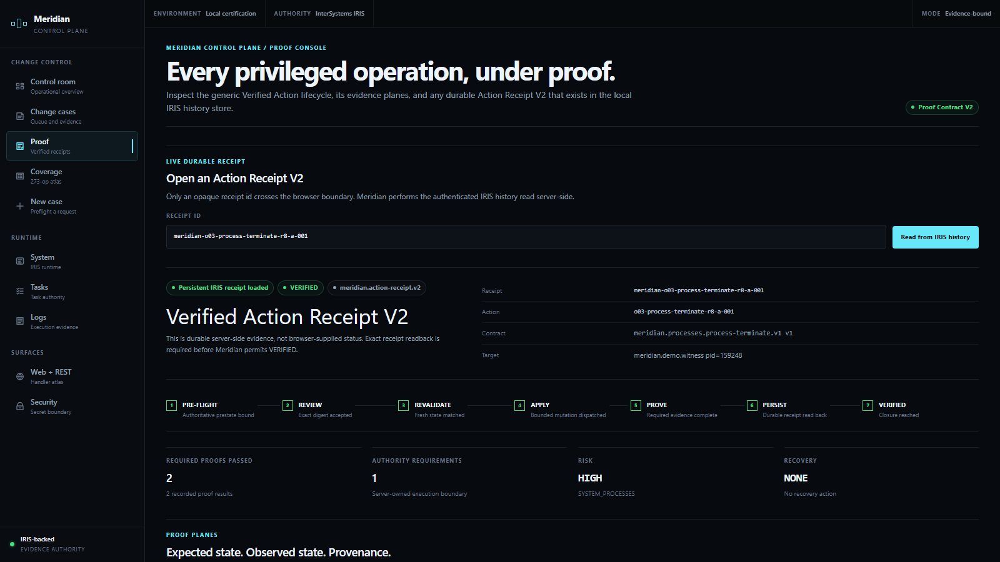
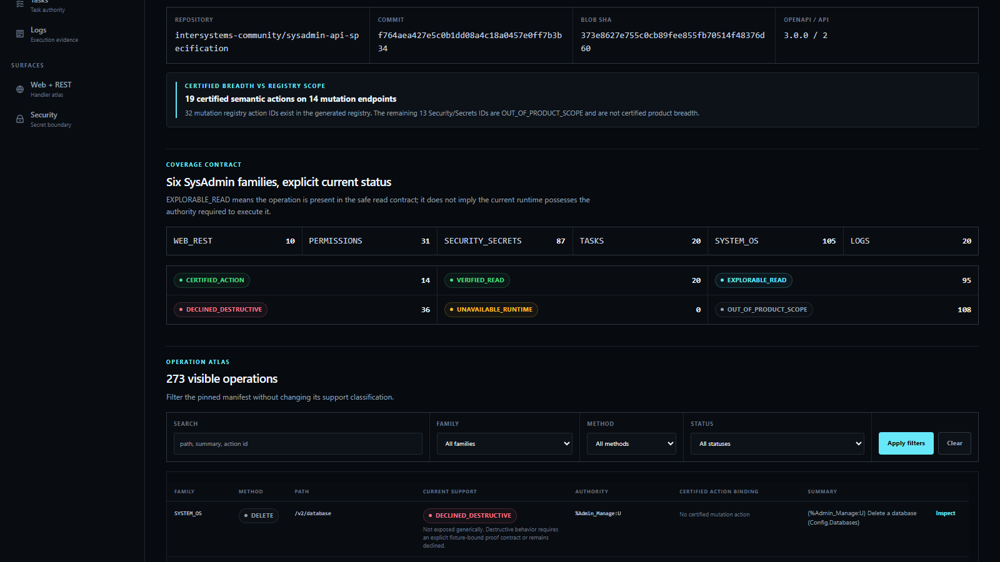
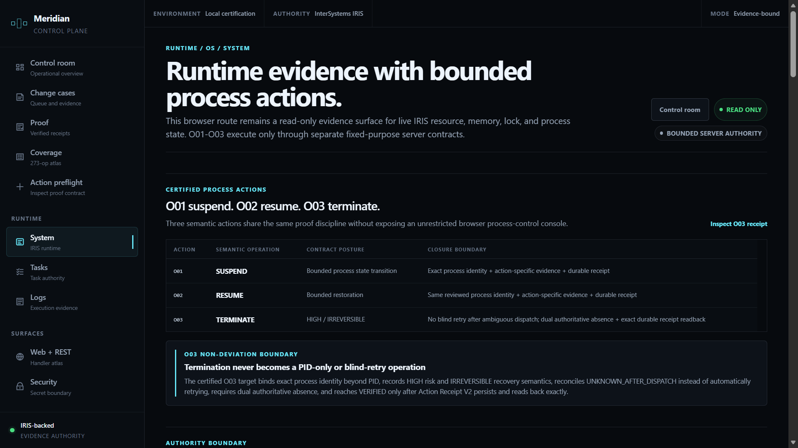
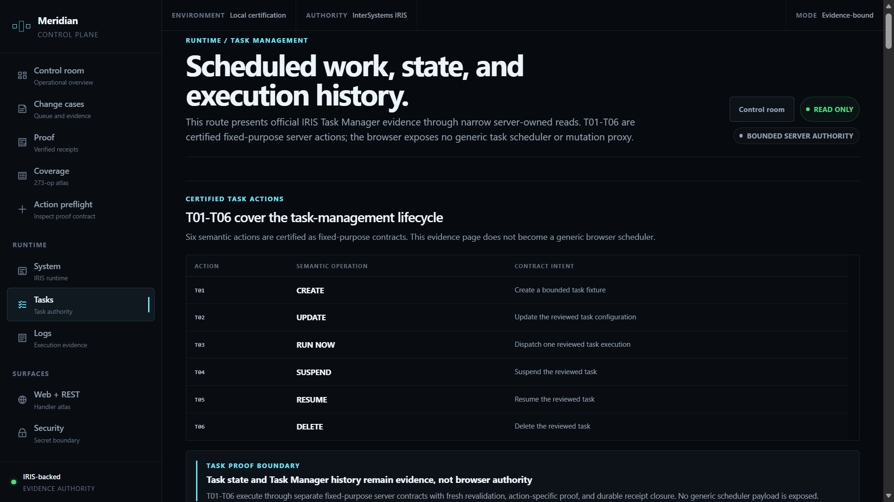

# Meridian

**Every privileged operation, under proof.**

Meridian is an evidence-bound management control plane for InterSystems IRIS. Selected administrative actions become typed proof contracts: **preflighted, freshly revalidated, executed through bounded server authority, reconciled when dispatch is ambiguous, verified on action-specific evidence planes, and sealed into durable hash-bound Action Receipt V2 records**.

> **APPLIED is not closure. VERIFIED requires the evidence chain.**

<p align="center">
  
</p>

Built for the **InterSystems Programming Contest — Build Your Own Management Portal**.

## Judge fast path

**[See the 30-second judge view](#30-second-judge-view)** · **[Inspect the 273-operation coverage atlas](#coverage-atlas)** · **[Read Proof Contract V2](#proof-contract-v2)** · **[See the certified action breadth](#certified-mutation-breadth)** · **[Inspect the case studies](#case-studies)** · **[Run Meridian locally](#reproducibility)** · **[Read the authority boundary](#authority-boundaries)**

The final post-R8 demo video is intentionally frozen separately from this README. The previous pre-Remontada recording is **not** presented as the final product demo.

**[Watch the 3:08 final product demo](https://youtu.be/w6Jxmg8Zkpw)**

---

## 30-second judge view

A successful management API response is not the same thing as verified operational closure.

Meridian makes five things immediately visible:

1. **No silent API gaps.** The pinned public InterSystems Community SysAdmin API specification is compiled into an explicit **273-operation support atlas**.
2. **Bounded mutation, not a generic proxy.** Fourteen certified mutation endpoints represent **nineteen fixed-purpose semantic actions** across permissions, tasks, processes, and web applications.
3. **Freshness before dispatch.** Reviewed intent is revalidated immediately before execution so stale state cannot silently inherit approval.
4. **Ambiguity is modeled, not retried away.** `UNKNOWN_AFTER_DISPATCH` is a first-class state with reconciliation instead of blind automatic retry.
5. **APPLIED is not VERIFIED.** Required evidence must complete and the durable receipt must persist before the action reaches `VERIFIED`.

| Final certified surface | Count |
| --- | ---: |
| Primary SysAdmin operations in the pinned atlas | **273** |
| Source operations including HEAD companions | **276** |
| `CERTIFIED_ACTION` endpoints | **14** |
| Fixed-purpose certified semantic actions | **19** |
| `VERIFIED_READ` operations | **20** |
| `EXPLORABLE_READ` operations | **95** |
| `DECLINED_DESTRUCTIVE` operations | **36** |
| `OUT_OF_PRODUCT_SCOPE` operations | **108** |

**Why 14 endpoints but 19 actions?** Some official API operations carry more than one bounded semantic contract. For example, `PUT /v2/security/user` backs four separately certified user actions, and `PUT /v2/web-app` backs three separately certified web-application actions. Meridian certifies the semantic action, not a generic mutation transport.

---

## Problem: API success is not proof

Administrative tooling often makes one moment visually dominant:

> **The write returned success.**

That matters, but it does not answer the harder operational questions:

- Was the intended target still the reviewed target at dispatch time?
- Did the reviewed pre-state remain unchanged?
- If transport failed after dispatch, did the mutation happen or not?
- What authoritative state proves the result?
- Which evidence planes are required for this particular action?
- Is the action reversible, compensatable, irreversible, or manual-recovery only?
- Can a durable receipt prove later what was reviewed, executed, observed, and closed?
- Did the browser receive only the authority it actually needed?

Meridian treats those questions as part of the action contract instead of post-hoc explanation.

> **A privileged change is not complete when an API call succeeds. It is complete when its contract closes under the required evidence and a durable receipt is persisted.**

---

## What shipped

Meridian is a working local prototype against a pinned InterSystems IRIS Community runtime, not a static mockup.

The final build includes:

- a **Next.js operator interface** with Control Room, Change Cases, Proof Console, Proof Coverage, System, Tasks, Logs, Security, and Web + REST surfaces;
- a generated **273-operation SysAdmin support atlas** derived from the pinned public `intersystems-community/sysadmin-api-specification` source at commit `f764aea427e5c0b1dd08a4c18a0457e0ff7b3b34`;
- **Proof Contract V2**, a typed lifecycle for heterogeneous privileged actions;
- **Action Receipt V2**, a canonical hash-bound durable receipt model;
- **19 certified semantic actions** across permissions, tasks, processes, and web applications;
- fixed-purpose server-side action transports rather than one generic privileged mutation proxy;
- fresh target/state revalidation immediately before dispatch;
- explicit risk and reversibility metadata;
- `UNKNOWN_AFTER_DISPATCH` reconciliation instead of blind retry;
- action-specific evidence planes for configuration, runtime, HTTP, permission, task, process, audit, log, and receipt truth;
- durable IRIS-backed action history;
- a least-privilege standing runtime identity with bounded server-held authority boundaries;
- pinned local reproduction around Docker, PowerShell, Node.js, Python, and IRIS; and
- automated tests, typechecking, linting, and production-build gates.

The normal quality wall is:

```powershell
npm test
npm run typecheck
npm run lint
npm run build
```

The final judge-surface certification passed **99 test files / 535 tests**, TypeScript checking, lint with **0 errors / 20 warnings**, and the production build.

---

## Proof Contract V2

The central product primitive is not a button or an endpoint. It is a typed action contract.

The generic lifecycle distinguishes review, execution, reconciliation, evidence, receipt persistence, and closure:

```text
CREATED
  ↓
PREFLIGHTING
  ↓
PREFLIGHTED
  ↓
APPROVED
  ↓
REVALIDATING ───────────────→ STALE / DENIED
  ↓
READY
  ↓
APPLYING ──────────────────→ APPLY_FAILED
  │
  ├────────────────────────→ UNKNOWN_AFTER_DISPATCH
  │                              ↓
  │                         RECONCILING
  │                              ├────────→ APPLIED
  │                              ├────────→ APPLY_FAILED
  │                              └────────→ UNKNOWN_AFTER_DISPATCH
  ↓
APPLIED
  ↓
VERIFYING ─────────────────→ VERIFY_FAILED / UNKNOWN_AFTER_DISPATCH
  ↓
EVIDENCE_COMPLETE
  ↓
RECEIPT_PERSISTING ────────→ RECEIPT_WRITE_FAILED
  ↓
VERIFIED
```

### Fresh revalidation

Approval belongs to a reviewed preflight, not to an arbitrary future state.

Before execution, the contract computes a fresh preflight digest. If the target or relevant pre-state changed, the action becomes `STALE` or `DENIED` before mutation.

### Dispatch ambiguity is explicit

Once a request may have crossed the dispatch boundary, retry can be more dangerous than failure.

Meridian therefore models `UNKNOWN_AFTER_DISPATCH` explicitly. The contract may reconcile authoritative state and classify the result as applied, not applied, or still unknown. It does not silently resend a consequential mutation.

### Risk and reversibility are contract data

Each Proof Contract declares:

- management domain;
- risk class: `LOW`, `MEDIUM`, or `HIGH`;
- reversibility: `REVERSIBLE`, `COMPENSATABLE`, `IRREVERSIBLE`, or `MANUAL_RECOVERY`;
- exact target identity;
- required authority;
- expected delta;
- safety predicates;
- evidence requirements; and
- recovery metadata.

That matters for actions such as process termination, where pretending that recreation is a rollback would be operationally false.

### Evidence is action-specific

The proof engine has explicit evidence planes including:

- `CONFIGURATION_READBACK`
- `LIVE_RUNTIME`
- `HTTP_BEHAVIOR`
- `PERMISSION_EFFECT`
- `TASK_STATE`
- `TASK_HISTORY`
- `PROCESS_STATE`
- `SECURITY_METADATA`
- `SECRET_INVENTORY`
- `X509_METADATA`
- `TLS_TEST`
- `NATIVE_AUDIT`
- `JOURNAL`
- `OPERATIONAL_LOG`
- `PERSISTENT_RECEIPT`

A contract selects which planes are required. Agreement from a correlated source does not magically become authoritative evidence.

Each proof result also carries an explicit provenance class:

- `AUTHORITATIVE_IRIS`
- `AUTHORITATIVE_EXTERNAL_PROBE`
- `MERIDIAN_DERIVED`
- `CORRELATED`
- `NOT_APPLICABLE`

Required evidence closes only when its matching result is `PASS`. `CORRELATED` evidence can support the narrative, but it is never silently promoted to authoritative proof; `NOT_APPLICABLE` is explicit rather than treated as missing success.

### Action Receipt V2

A verified receipt binds the evidence needed to reconstruct the action later:

- action and contract identity;
- exact target identity;
- actor and IRIS runtime identity;
- required authority;
- intent digest;
- reviewed preflight digest;
- fresh revalidation digest;
- execution digest;
- evidence digest;
- proof results;
- lifecycle timestamps;
- reversibility/recovery metadata;
- terminal evidence-complete event hash; and
- canonical `receiptSha256`.

<p align="center">
  
</p>

---

## Coverage atlas

The `/proof-coverage` route makes the pinned SysAdmin surface judgeable instead of hiding unsupported operations.

<p align="center">
  
</p>

The atlas is generated from the pinned public `intersystems-community/sysadmin-api-specification` source at commit `f764aea427e5c0b1dd08a4c18a0457e0ff7b3b34`, not hand-counted.

The generated mutation registry contains **32 action IDs**, but that is registry scope—not certified breadth. The final certification set is **19 semantic actions**; the other **13 Security/Secrets action IDs** remain `OUT_OF_PRODUCT_SCOPE` and are not presented as certified product capabilities.

Every primary operation receives an explicit support classification:

| Classification | Meaning | Count |
| --- | --- | ---: |
| `CERTIFIED_ACTION` | At least one fixed-purpose semantic action using this transport is live-certified | **14** |
| `VERIFIED_READ` | Read behavior is directly verified for the product | **20** |
| `EXPLORABLE_READ` | Present in the bounded safe-read explorer contract | **95** |
| `DECLINED_DESTRUCTIVE` | Deliberately refused rather than casually exposed | **36** |
| `OUT_OF_PRODUCT_SCOPE` | Visible in the atlas but not claimed as a product capability | **108** |

The distinction is intentional:

> **Coverage means every operation has an explicit product decision. It does not mean every operation is executable.**

The browser does not receive a generic mutation dispatcher.

---

## Certified mutation breadth

The final certification set contains **19 semantic actions on 14 official mutation endpoints**.

### Permissions — 6 actions

- `P01_ROLE_CREATE`
- `P02_ROLE_DELETE`
- `P03_USER_ADD_ROLE`
- `P04_USER_REMOVE_ROLE`
- `P05_USER_ENABLE`
- `P06_USER_DISABLE`

### Tasks — 6 actions

- `T01_TASK_CREATE`
- `T02_TASK_UPDATE`
- `T03_TASK_RUN_NOW`
- `T04_TASK_SUSPEND`
- `T05_TASK_RESUME`
- `T06_TASK_DELETE`

### System / processes — 3 actions

- `O01_PROCESS_SUSPEND`
- `O02_PROCESS_RESUME`
- `O03_PROCESS_TERMINATE`

### Web applications — 4 actions

- `W01_WEB_APP_CREATE`
- `W02_WEB_APP_UPDATE`
- `W03_WEB_APP_ENABLE`
- `W04_WEB_APP_DELETE`

### Exact endpoint-to-action map

| Official SysAdmin mutation endpoint | Certified semantic action(s) |
| --- | --- |
| `POST /v2/process/suspend` | `O01_PROCESS_SUSPEND` |
| `POST /v2/process/resume` | `O02_PROCESS_RESUME` |
| `POST /v2/process/terminate` | `O03_PROCESS_TERMINATE` |
| `PUT /v2/security/role` | `P01_ROLE_CREATE` |
| `DELETE /v2/security/role` | `P02_ROLE_DELETE` |
| `PUT /v2/security/user` | `P03_USER_ADD_ROLE`, `P04_USER_REMOVE_ROLE`, `P05_USER_ENABLE`, `P06_USER_DISABLE` |
| `POST /v2/task` | `T01_TASK_CREATE` |
| `PUT /v2/task` | `T02_TASK_UPDATE` |
| `POST /v2/task/run` | `T03_TASK_RUN_NOW` |
| `POST /v2/task/suspend` | `T04_TASK_SUSPEND` |
| `POST /v2/task/resume` | `T05_TASK_RESUME` |
| `DELETE /v2/task` | `T06_TASK_DELETE` |
| `PUT /v2/web-app` | `W01_WEB_APP_CREATE`, `W02_WEB_APP_UPDATE`, `W03_WEB_APP_ENABLE` |
| `DELETE /v2/web-app` | `W04_WEB_APP_DELETE` |

Each action remains fixed-purpose and contract-bound even when multiple actions share an official SysAdmin endpoint.

Meridian does **not** claim certified mutation breadth for Logs or Security/Secrets. Those families remain evidence/read surfaces in the submitted product.

---

## Case studies

The generic proof engine matters because very different administrative actions should not be forced into the same verification story.

### 1. Process identity safety — suspend, resume, terminate

The O01/O02/O03 trilogy demonstrates the high-risk end of the model.

A process action is not authorized by PID alone. The certified target identity binds the reviewed process generation and other identity evidence so PID reuse cannot silently redirect authority.

The trilogy proved three different semantics:

- **Suspend** — reversible bounded process state transition;
- **Resume** — bounded restoration of the same reviewed process identity;
- **Terminate** — `HIGH` risk and `IRREVERSIBLE`.

For terminate, an HTTP 200 was not treated as proof of closure. Meridian required authoritative absence of the exact reviewed identity. Once dispatch occurred, automatic retry was forbidden. The final durable receipt truthfully records irreversible recovery metadata rather than pretending witness recreation is rollback.

That is the design principle in its strongest form:

> **The more consequential the action, the less Meridian relies on optimistic transport success.**

<p align="center">
  
</p>

### 2. Task-management lifecycle — create through delete

The T01-T06 family demonstrates that scheduled-work administration is not treated as one generic scheduler payload:

- `T01_TASK_CREATE`
- `T02_TASK_UPDATE`
- `T03_TASK_RUN_NOW`
- `T04_TASK_SUSPEND`
- `T05_TASK_RESUME`
- `T06_TASK_DELETE`

The `/tasks` route keeps the browser read-only while surfacing live inventory, upcoming schedule, raw Task Manager history, and retained certification-witness rows. Certified execution stays behind fixed-purpose server contracts.

<p align="center">
  
</p>

### 3. Maya Patel supervisor removal

The original Maya case remains a useful permissions example, but it is now one concrete case inside the broader proof engine.

The recorded operation removes:

```text
MeridianSupervisor FROM maya.patel
```

The case keeps several truths separate:

- reviewed intent;
- direct/effective role state;
- expected permission delta;
- authoritative configuration readback;
- live process authority;
- native `UserChange` audit evidence; and
- durable receipt history.

<p align="center">
  
</p>

The verified case route is:

```text
/change-cases/verified/maya-patel-supervisor-removal
```

It is a recorded certified receipt plus a live server-side persistent-history check. Visiting the page does **not** re-execute the role mutation.

---

## Authority boundaries

Meridian does not equate “server authenticated” with “server may do anything.”

### Standing runtime

The application authenticates to IRIS as:

```text
meridian.runtime
```

with standing role:

```text
MeridianControlPlaneRuntime
```

The standing runtime remains without broad grants such as:

- `%Admin_Manage`;
- `%Admin_Task`;
- `%Admin_Operate`;
- `%Admin_Journal`; and
- `%DB_USER WRITE`.

### Bounded server authority

Read capabilities and action execution are isolated behind dedicated bounded server-held roles and fixed-purpose contracts rather than added permanently to the standing runtime.

Examples include:

- `MeridianSecurityMetadataReader`
- `MeridianTaskMetadataReader`
- `MeridianSystemMetadataReader`
- fixed-purpose action executor roles
- `MeridianReceiptHistoryWriter`
- `MeridianControlPlaneHelperExecution`

The exact authority expression required by each official operation is preserved in the generated coverage manifest.

### Browser boundary

The browser receives rendered evidence and supported intent selectors.

It does **not** receive:

- the privileged runtime password;
- bearer credentials used by server-owned sessions;
- arbitrary role or task payload authority;
- an unrestricted process control surface;
- a generic SysAdmin mutation proxy; or
- secret/private-key material from the Security surface.

The action contracts live on the server side. The browser does not get to invent a different target, authority expression, transport, or proof standard.

---

## IRIS management surfaces

Meridian covers the pinned SysAdmin management families without flattening them into one over-privileged dashboard.

| Family | Judge-facing surface | Certified product boundary |
| --- | --- | --- |
| **Permissions** | Change Cases, impact, configuration, live access, audit, receipts | 6 fixed-purpose certified actions |
| **Web + REST** | Application inventory, deployed REST truth, protection metadata, receipt/current-state join | 4 fixed-purpose certified web-app actions |
| **Security / Secrets** | Approved metadata, secret boundary, certificate/TLS evidence where applicable | Evidence/read surface; no certified mutation breadth claimed |
| **Tasks** | Inventory, schedule, state, execution history | 6 fixed-purpose certified task actions |
| **System / OS** | Resource, memory, locks, process evidence | 3 fixed-purpose certified process actions |
| **Logs** | Operational records by source, severity, and time | Evidence/read surface; no certified mutation breadth claimed |

### Browser routes

| Route | Purpose |
| --- | --- |
| `/` | Control Room |
| `/change-cases` | Change Queue and recorded evidence |
| `/change-cases/new` | Read-only Action Preflight / Proof Contract inspector |
| `/change-cases/verified/maya-patel-supervisor-removal` | Certified permissions case |
| `/proof` | Durable Action Receipt V2 inspector and proof lifecycle |
| `/proof-coverage` | 273-operation support atlas and bounded read explorer |
| `/system` | Runtime / OS / process evidence |
| `/tasks` | Task evidence |
| `/logs` | Operational-log evidence |
| `/security-secrets` | Security metadata and secret boundary |
| `/web-rest` | Web application + REST evidence |

A route being evidence-first does not imply the server exposes a generic action console. Certified mutations remain fixed-purpose contracts.

---

## Architecture

Meridian separates browser intent, server orchestration, bounded authority, authoritative IRIS state, and durable evidence.

<p align="center">
  
</p>

Conceptually:

```text
Browser
  │
  │ reviewed intent / rendered evidence
  ▼
Next.js server BFF
  │
  ▼
Proof Contract V2 runner
  ├─ preflight + impact
  ├─ safety predicates
  ├─ fresh revalidation
  ├─ fixed-purpose action transport
  ├─ unknown-dispatch reconciliation
  ├─ action-specific verification
  └─ Action Receipt V2
        │
        ├──────────────► durable IRIS history
        │
        ▼
Bounded IRIS authority
  ├─ official SysAdmin REST
  ├─ narrow private helper where required
  ├─ native/runtime evidence
  └─ authoritative readback
```

### Why IRIS is indispensable

IRIS is not merely a persistence layer behind the UI.

It supplies the authoritative management and evidence surfaces used to close contracts:

- security configuration;
- task state/history;
- process/runtime state;
- web-application configuration;
- deployed REST evidence;
- operational metadata;
- native audit evidence;
- permission effects; and
- durable receipt history.

Remove IRIS and Meridian loses the authority needed to prove the state transitions it claims.

---

## Web + REST proof model

Meridian deliberately keeps different kinds of Web + REST truth separate.

<p align="center">
  
</p>

| Evidence plane | Source | Claim |
| --- | --- | --- |
| Web application inventory | Official SysAdmin REST | Live application identity and configuration |
| Deployed REST truth | Native emitted Swagger | Proven deployment |
| Protection metadata | Authoritative OpenAPI | Proven declared metadata |
| Verified action history | Durable hash-bound receipts | Historical certified mutation evidence |
| Current-state recheck | Official SysAdmin + live HTTP | Fresh current state |

Historical proof is not rewritten to match current state. A durable receipt remains historical evidence; current state is re-read separately.

---

## Reliability model

Meridian prefers explicit failure states over optimistic UI state.

Key invariants include:

- **APPLIED is not VERIFIED.**
- **Reviewed state is revalidated before mutation.**
- **PID alone is not sufficient process identity.**
- **Transport ambiguity does not authorize blind retry.**
- **Required proof results must close before durable verification.**
- **Receipt persistence is part of closure, not an afterthought.**
- **Historical receipt truth and current-state readback remain separate.**
- **A successful API response is never promoted into stronger evidence than it actually provides.**
- **Risk and reversibility remain explicit.**
- **The browser never owns generic privileged IRIS authority.**
- **Unsupported operations stay visibly unsupported.**

---

## Technology

- **InterSystems IRIS Community 2026.2 Build 221U** — authoritative management, runtime, audit, and persistence substrate;
- **InterSystems SysAdmin REST** — primary official management surface;
- **ObjectScript REST classes** — Meridian private helper and durable-history boundaries;
- **`intersystems-irispython==5.4.0`** — pinned local DB-API dependency used by the certified reproduction path;
- **Next.js 16.3.3** — operator application and server BFF;
- **React 19.2.8**;
- **TypeScript**;
- **Vitest 4.1.11**;
- **Docker** — pinned IRIS Community runtime; and
- **Windows PowerShell 5.1** — certified local setup/reproduction wrapper.

Dependency versions in `package.json`, `package-lock.json`, and `requirements-iris.txt` remain authoritative.

---

## Project structure

```text
meridian-control-plane/
├─ src/
│  ├─ app/
│  │  ├─ change-cases/        Change Cases and recorded case evidence
│  │  ├─ proof/               durable receipt inspector + Proof Contract V2
│  │  ├─ proof-coverage/      generated SysAdmin support atlas
│  │  ├─ system/              runtime / OS / process evidence
│  │  ├─ tasks/               task evidence
│  │  ├─ logs/                operational-log evidence
│  │  ├─ security-secrets/    metadata-only security/secret boundary
│  │  └─ web-rest/            web app + REST evidence
│  └─ lib/
│     ├─ actions/             fixed-purpose semantic action contracts
│     ├─ proof/               generic proof engine + Action Receipt V2
│     ├─ operations/          generated coverage manifest
│     └─ iris/                IRIS transports, sessions, readers, writers
├─ iris/
│  ├─ Meridian.API.spec.cls
│  ├─ Meridian.API.impl.cls
│  ├─ Meridian.ControlPlane.Internal.REST.cls
│  └─ Meridian.ControlPlane.History.REST.cls
├─ scripts/
│  ├─ bootstrap-iris.ps1
│  ├─ meridian-repro.ps1
│  ├─ generate-sysadmin-operation-manifest.mts
│  ├─ iris-*-witness-*.py
│  └─ verify-*.mts
├─ docs/
│  ├─ PRODUCT_CONTRACT.md      frozen product / claim boundary
│  └─ assets/                  judge-facing final visuals
├─ .env.example
├─ requirements-iris.txt
└─ package.json
```

---

## Reproducibility

### Requirements

The certified path currently assumes:

- Docker with Linux containers;
- Node.js and npm;
- Python 3 available as `python.exe` or `py.exe`;
- Windows PowerShell 5.1 through `powershell.exe`; and
- free host ports `1972`, `52773`, and `3000`.

The IRIS runtime is pinned to:

```text
intersystems/iris-community@sha256:d4331089a4d19aafa867c26b343eb2b8486cf112ef1522132761e6327691377e
```

The certified runtime is **InterSystems IRIS 2026.2 Build 221U**.

### 1. Clone

```powershell
git clone https://github.com/chizzydev/meridian-control-plane.git
Set-Location .\meridian-control-plane
```

### 2. Start the pinned IRIS container

```powershell
docker run `
  --name iris-cert `
  -d `
  -p 1972:1972 `
  -p 52773:52773 `
  intersystems/iris-community@sha256:d4331089a4d19aafa867c26b343eb2b8486cf112ef1522132761e6327691377e
```

Wait for health:

```powershell
docker inspect --format "{{.State.Health.Status}}" iris-cert
```

Expected:

```text
healthy
```

### 3. Check setup without applying changes

```powershell
npm run demo:setup:check
```

This read-only check validates the container, local dependencies, helper surface, and frozen bootstrap convergence.

### 4. Set up Meridian on a fresh instance

```powershell
npm run demo:setup
```

`demo:setup`:

- runs `npm ci`;
- creates the repository-local `.venv-iris` environment when needed;
- installs the pinned `intersystems-irispython==5.4.0` dependency;
- applies the declarative IRIS bootstrap; and
- verifies convergence.

On a fresh IRIS instance, setup prompts for the local passwords required to create bounded runtime identities. Real passwords are not committed to the repository or passed on the command line.

### 5. Check readiness

```powershell
npm run demo:readiness
```

### 6. Normalize the bounded demo fixture when needed

```powershell
npm run demo:cycle
```

`demo:cycle` is the supported repeatable fixture lifecycle. It is **not** an arbitrary process-kill mechanism and it is **not** a generic security reset.

The sealed O01/O02/O03 process certifications are historical evidence. Reproduction does not require physically rerunning those exact process actions.

### 7. Start Meridian

```powershell
npm run demo:start
```

The startup wrapper prompts for the `meridian.runtime` password using a masked `SecureString`, passes plaintext only to the child server process environment, and zero-frees the temporary BSTR afterward.

Open:

```text
http://localhost:3000
```

### Quality wall

```powershell
npm test
npm run typecheck
npm run lint
npm run build
```

Final certified result:

- **99 test files / 535 tests: PASS**
- **TypeScript typecheck: PASS**
- **ESLint: 0 errors / 20 warnings**
- **Production build: PASS**

---

## Environment

`.env.example` documents the server-side runtime contract:

```text
MERIDIAN_IRIS_API_BASE_URL=http://localhost:52773/api/admin
MERIDIAN_IRIS_HELPER_BASE_URL=http://localhost:52773/meridian-control-plane-internal
MERIDIAN_IRISPYTHON_EXECUTABLE=.venv-iris/Scripts/python.exe
MERIDIAN_RUNTIME_USERNAME=meridian.runtime
MERIDIAN_RUNTIME_PASSWORD=
```

Keep `MERIDIAN_RUNTIME_PASSWORD` blank in committed files.

The certified startup path supplies the real password only to the running server process.

---

## Certified operator commands

| Command | Purpose |
| --- | --- |
| `npm run demo:bootstrap:check` | Read-only declarative IRIS bootstrap convergence check |
| `npm run demo:bootstrap` | Apply only missing frozen bootstrap state; privilege drift fails closed |
| `npm run demo:setup:check` | Read-only setup/convergence check |
| `npm run demo:setup` | Install dependencies, apply bootstrap, and verify setup |
| `npm run demo:readiness` | Read bounded fixture readiness |
| `npm run demo:cycle` | Run the safe repeatable fixture lifecycle |
| `npm run demo:start` | Start production Meridian with a masked runtime-password prompt |

Focused engineering verification commands remain available through the `verify:*` scripts in `package.json`.

---

## Security and claim boundaries

Meridian's claims are intentionally narrower than “full management portal replacement.”

### Security choices

- No runtime password is committed to Git.
- `.env.example` contains the password variable but no password value.
- The production start wrapper uses `Read-Host -AsSecureString`.
- Privileged runtime credentials stay on the server side.
- Browser management routes do not expose an arbitrary IRIS mutation proxy.
- Dedicated metadata readers and fixed-purpose action executors avoid broad standing authority.
- Durable-history writing is application-scoped.
- Security pages expose approved metadata, never secret values or private-key material.
- Process operations require bounded target identity; PID alone is insufficient.
- Unknown-after-dispatch paths reconcile instead of automatically retrying.
- Irreversible actions remain labeled irreversible.

### Meridian does not claim

- that IRIS security is broken;
- that every management endpoint is implemented;
- that all 273 primary operations are executable;
- that Logs has certified mutation breadth;
- that Security/Secrets has certified mutation breadth;
- that declared OpenAPI protection metadata proves arbitrary application-code authorization behavior;
- that native Swagger proves anything beyond deployment evidence it actually contains;
- that an HTTP success code alone proves an administrative action closed;
- that the public browser owns privileged IRIS credentials;
- that the default runtime has `%All` or `%Admin_Manage`;
- that recreating a terminated process is rollback of the same identity; or
- that visiting a recorded case page re-executes its historical mutation.

---

## Prototype limits

Meridian is a competition prototype with a deliberately strong evidence core.

Current limitations include:

- the certified reproduction path is Windows/PowerShell-oriented;
- it targets the pinned submission IRIS build;
- operator authentication/approval is not a production multi-user IAM system;
- certified server actions remain fixed-purpose contracts rather than a generic browser action console;
- Logs and Security/Secrets are evidence/read surfaces rather than certified mutation families;
- 108 primary operations are explicitly out of product scope;
- 36 destructive operations are explicitly declined; and
- clean-room setup is optimized for a local Docker-backed judge environment rather than fleet deployment.

A production evolution could add multi-operator policy, durable multi-case queues, multi-instance inventory, additional platform wrappers, external observability, and environment-specific approval policy without weakening the core invariant.

> **New breadth should add evidence, not erase the distinction between dispatch, authoritative state, proof, and durable closure.**

---

## Final demo video

The final demo must reflect the post-R8 product, including Proof Contract V2, the Coverage atlas, durable receipts, certified action breadth, authority boundaries, and reproducibility.

<!-- FJ3_FINAL_VIDEO_LINK_WILL_REPLACE_THIS_PARAGRAPH -->

The previous pre-Remontada recording is intentionally not used as the final judge video.

---

## License

MIT — see [LICENSE](./LICENSE).
